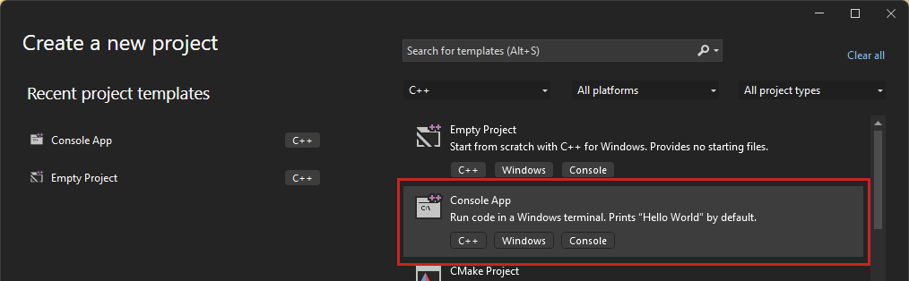
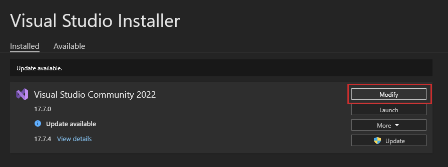
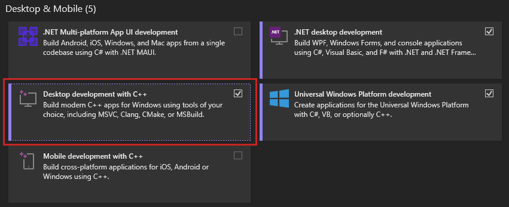

# Lab 0 - Setup
## Introduction
In this module, we will be using the OpenGL (Open Graphics Library) programming interface with the C++ language. For this reason, this lab will give an introduction to C++ with assumed understanding of other general purpose object oriented programming languages, such as C# & Java.

## Setup
All labs will utilise Visual Studio 2019 or 2022 with Windows 10 or 11. Run Visual Studio and click 'Create a new project' & create a project of type 'Console App' with the tags C++, Windows & Console.

If this does not appear, then run the Visual Studio Installer. Find the relevant Visual Studio installation, select 'Modify.' Next, select the 'Desktop development with C++' package & select 'Modify' at the bottom right of the window in order to add the package. Once the package is installed, proceed to run Visual Studio to create the relevant project.

If your project contains no sample code, nor has a .cpp file, navigate to this repository's equivalent project in Lab1/Solutions/Output & use it instead.

**Create Empty C++ Project**

**Modify Visual Studio Installation**

**Install Relevant C++ Package**
